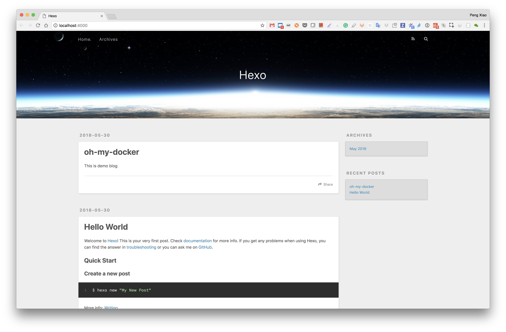

# hexo-docker

[](https://quay.io/repository/oh-my-docker/hexo)

Play hexo just through docker and without installing node.js and hexo on your computer.

```bash
docker pull quay.io/oh-my-docker/hexo
```

## Create a blog

Create a `blog` folder under /Users/penxiao/tmp through `hexo init` command.

```bash
docker run -it --rm -v /Users/penxiao/tmp:/omd quay.io/oh-my-docker/hexo hexo init blog
```

Install requirements

```bash
docker run -it --rm -v /Users/penxiao/tmp:/omd quay.io/oh-my-docker/hexo sh -c "cd blog; npm install"
```

## Edit blog

Create a new blog article, for example called oh-my-docker

```bash
$ docker run -it --rm -v /Users/penxiao/tmp:/omd quay.io/oh-my-docker/hexo sh -c "cd blog; hexo new oh-my-docker"
INFO  Created: /omd/blog/source/_posts/oh-my-docker.md
$ _posts ls
hello-world.md  oh-my-docker.md
```

then we can add contents to oh-my-docker.md.

## Preview

Start a simple web server, and preview our blog.

```bash
docker run -it --rm -p 4000:4000 -v /Users/penxiao/tmp:/omd quay.io/oh-my-docker/hexo sh -c "cd blog; hexo serve"
INFO  Start processing
INFO  Hexo is running at http://localhost:4000/. Press Ctrl+C to stop.
```

Open the browser and go to http://localhost:4000/ we will see:



Because the preview is live, we can do some change on source post markdown file and see the changes through browser in the same time with just a refresh page.

Have fun!

## Welcome to subcribe MY WeChat official account

欢迎大家订阅我的公众号，会不定期分享一些容器，网络，和编程相关技术文章。


